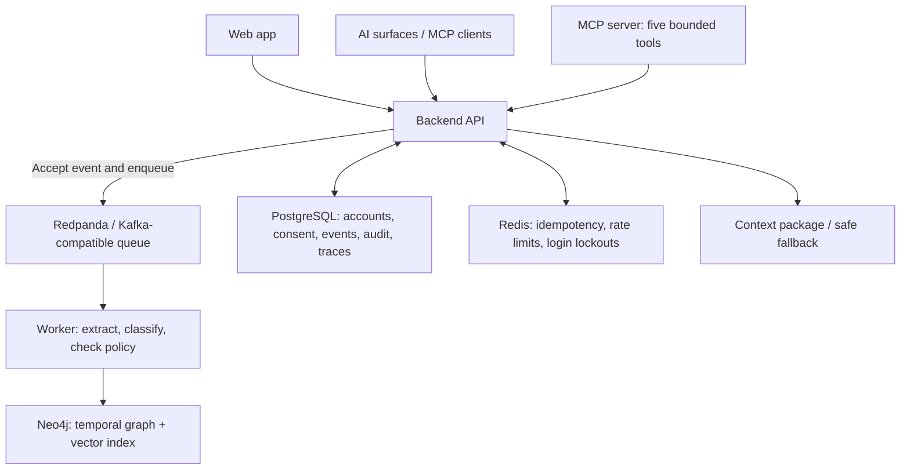

<div align="center">

# 🎧 Spotify Personalized AI Memory System

### A governed, privacy-aware memory layer for personalized AI experiences

Capture listener preferences, turn them into sourced and time-bounded memories, retrieve only relevant context, and keep the listener in control through review, correction, pause, opt-out, and deletion.

<p>
  <a href="https://spotifyfrontend11.netlify.app"><strong>🚀 Open Live App</strong></a> ·
  <a href="https://spotify-personalized-ai.onrender.com/docs"><strong>📚 API Docs</strong></a> ·
  <a href="https://drive.google.com/file/d/1WQNTwhhecQDPgv9NEN7sOmlCRjId33n5/view?usp=sharing"><strong>▶ Watch Demo Video</strong></a> ·
  <a href="https://github.com/omsemwal/spotify-fronted"><strong>🖥️ Frontend Repository</strong></a>
</p>


</div>

> **Project status:** Product-capability pilot — not a general-purpose behaviour archive. Every remembered fact carries provenance, confidence, a policy class, and a valid time, and can be corrected or deleted.

---

## 🔗 Quick links

| Resource | Link | What it is |
|---|---|---|
| **Live application** | [spotifyfrontend11.netlify.app](https://spotifyfrontend11.netlify.app) | Sign up and explore the memory console |
| **Live API** | [spotify-personalized-ai.onrender.com](https://spotify-personalized-ai.onrender.com) | Deployed backend API |
| **Interactive API documentation** | [OpenAPI / Swagger UI](https://spotify-personalized-ai.onrender.com/docs) | Inspect endpoints and try supported requests |
| **Store health** | [Health of stores](https://spotify-personalized-ai.onrender.com/health/stores) | Inspect the deployed store-health endpoint |
| **Demo video** | [Watch here ](https://drive.google.com/file/d/1WQNTwhhecQDPgv9NEN7sOmlCRjId33n5/view?usp=sharing) | Project walkthrough |
| **Backend repository** | [spotify-personalized-ai](https://github.com/omsemwal/spotify-personalized-ai) | API, worker, MCP server, data, tests, and backend documentation |
| **Frontend repository** | [spotify-fronted](https://github.com/omsemwal/spotify-fronted) | Next.js web applications and frontend documentation |

## 📑 Contents

- [Overview](#-overview)
- [Try the live app](#-try-the-live-app)
- [Features](#-features)
- [Technology stack](#-technology-stack)
- [Architecture and data flow](#-architecture-and-data-flow)
- [Frontend experience](#-frontend-experience)
- [Backend API](#-backend-api)
- [MCP tools](#-mcp-model-context-protocol-tools)
- [Data model](#-data-model)
- [Privacy and security](#-privacy-and-security)
- [Run locally](#-run-locally)
- [Environment variables](#-environment-variables)
- [Deployment](#-deployment)
- [Tests and reported results](#-tests-and-reported-results)
- [Screenshots](#-screenshots)
- [Documentation index](#-documentation-index)
- [Known limitations](#-known-limitations)
- [Repository layout](#-repository-layout)

---

## 🌟 Overview

Spotify Personalized AI Memory is a governed memory layer for AI experiences. It captures what a listener explicitly says, turns eligible information into typed, time-bounded memories, finds relevant memories for a request, and provides the AI orchestrator with a small, sourced context package.

The system is designed to address three problems:

- **Context fragmentation:** preferences shared in one interaction may not be available in a later interaction.
- **Lack of user control:** listeners need ways to inspect, correct, pause, opt out of, and delete remembered information.
- **Data risk and noise:** irrelevant, outdated, unsupported, or policy-disallowed information should not be sent to an AI surface.

### Core principles

- **Provenance:** memories retain source information.
- **Confidence and policy:** candidate extraction is checked by deterministic rules; a model output alone does not create a memory.
- **Time-aware memory:** facts can have valid-time boundaries, and corrections preserve history.
- **Bounded context:** retrieval is ranked, policy-filtered, diversity-capped, and constrained by a token budget.
- **Listener control:** review, correction, removal, pause, and opt-out are supported.
- **Fail-safe fallback:** a deterministic no-memory response path is available when memory cannot safely be used or a store is unavailable.
- **Auditing:** reads and writes are tied to an authenticated subject and traceable, with sensitive text redacted in traces.

## 🎵 Try the live app

1. Open the [live application](https://spotifyfrontend11.netlify.app).
2. Choose **Create an account** and sign up using an unused user ID made from lowercase letters, digits, and underscores (`_`). Choose a password with at least 8 characters.
3. Open **Context preview** and tell Spotify's AI something like: `I love Arijit Singh romantic songs, but no heavy metal`.
4. After the event has been processed, ask: `play something romantic`.
5. Inspect which memories were found, how they ranked, what policy removed, and the final context package prepared for the AI. The page also includes a clearly labelled song-preview demonstration.

**Privacy reminder:** each account should only see its own data. Test accounts `user_001` through `user_005` are for local testing only and use the backend's `DEMO_PASSWORD` setting; do not assume they are enabled on the public deployment.

---

## ✨ Features

| Area | What it does |
|---|---|
| **Capture** | `POST /v1/events` validates subject, consent, schema version, idempotency, and source, queues the event, and responds without waiting for the graph write. |
| **Understand** | A worker uses Gemini to propose typed candidates. Deterministic rules decide memory type, entities, confidence, and policy class. A model's output alone never creates a memory. |
| **Remember** | Neo4j stores temporal graph memories with `valid_from`, `valid_to`, `recorded_at`, confidence, and status. Corrections supersede earlier memories and preserve history; repeated evidence strengthens rather than duplicates a memory. |
| **Retrieve** | Hybrid graph and vector search ranks relevant memories using six weighted signals, filters them by surface policy, and caps results for diversity. |
| **Compose context** | Builds a token-budgeted package with provenance and relevance reasons. Stored text is fenced as data against prompt injection. A deterministic no-memory fallback is available, including when a store is down. |
| **Listener controls** | Review, correct, expire, delete, pause, and opt out. Deletion tracks propagation status across stores rather than silently reporting partial completion as success. |
| **Governance** | Retention rules vary by memory type, region, and age. Consent is checked before memory use, and every read/write is bound to an authenticated subject. |
| **Observability** | Overview metrics, quality review, audit traces, deletion backlog, fallback rate, ingestion lag, policy rejections, and other operational signals are surfaced in the frontend. |
| **MCP integration** | Exposes five purpose-built memory tools to compatible model clients without providing a generic graph-query tool. |

---

## 🧰 Technology stack

Badges below summarise technologies named in the supplied project READMEs. They are technology labels, not claims that a third-party certification or build-status check has passed.

### Application and AI

| Layer | Technology | Role |
|---|---|---|
| Backend | Python, FastAPI, Uvicorn | API service, validation, authentication-related routes, metrics, and orchestration endpoints |
| Frontend | Next.js, React, Tailwind CSS | Login, memory console, listener controls, dashboards, and context preview |
| Extraction model | Google Gemini | Proposes typed memory candidates for the extraction flow |
| Embeddings | SentenceTransformers `all-MiniLM-L6-v2`, run with FastEmbed | Produces 384-dimensional vectors without using PyTorch for this embedding path |
| Tool integration | Model Context Protocol (MCP) | Exposes the five bounded memory tools to model clients |

### Data, messaging, and infrastructure

| Technology | Role in this project |
|---|---|
| **Neo4j** | Temporal memory graph and vector index; graph relationships include `ABOUT` and `SUPERSEDES` |
| **PostgreSQL** | Accounts, consent, events, audit log, deletion jobs, traces, and relational tables |
| **Redis** | Idempotency keys, rate limits, and login lockouts |
| **Redpanda / Kafka-compatible messaging** | Event queue and dead-letter topic for failed processing |
| **Docker Compose** | Starts the local data services: PostgreSQL, Redis, Neo4j, and Redpanda |
| **Netlify / Vercel** | Frontend deployment options |
| **Render** | Backend API and worker deployment option |
| **Neon** | PostgreSQL hosting option described in the deployment setup |
| **Neo4j AuraDB** | Hosted Neo4j option described in the deployment setup |
| **Redpanda Cloud** | Hosted Kafka-compatible messaging option described in the deployment setup |

---

## 🏗️ Architecture and data flow

The backend is split into an API process and a worker process, with four supporting stores/services in the local architecture. On a free hosting setup, the worker can run inside the API process by setting `RUN_WORKER_IN_API=true`.



### End-to-end flow

1. **Capture:** the API validates the event contract, subject, consent, schema version, idempotency key, and source.
2. **Queue:** the event is queued and the API responds; the listener does not wait for the graph write.
3. **Extract:** the worker asks Gemini for candidate structured memories.
4. **Validate and govern:** deterministic rules evaluate type, entities, confidence, policy class, and eligibility.
5. **Store:** approved memories are stored in the Neo4j temporal graph with their metadata and vector representation; supporting operational records are stored in PostgreSQL and Redis as appropriate.
6. **Retrieve:** a request triggers hybrid graph/vector retrieval, ranking, policy filtering, and diversity limits.
7. **Compose:** the API returns a bounded, sourced context package—or a deterministic no-memory fallback.
8. **Control and audit:** user changes propagate through deletion/correction flows and the relevant operations can be inspected through traces and status views.

For the full backend flow, see [`docs/HOW_IT_WORKS.md`](https://github.com/omsemwal/spotify-personalized-ai/blob/main/docs/HOW_IT_WORKS.md) in the backend repository.

---

## 🖥️ Frontend experience

The frontend repository contains two Next.js apps that share the login flow:

```text
apps/
├── memory-console/   Main application: login and seven screens
└── memory-controls/  Listener review/control page, using the same login
```

### The seven memory-console screens

| # | Screen | What it shows |
|---:|---|---|
| 1 | **Overview** | Service health, ingestion lag, retrieval SLO against the 250 ms budget, fallback rate, write failures, cache hit rate, policy rejections, quality, experiment status, and deletion backlog |
| 2 | **Memory explorer** | The user's memories, timeline, relationships, source, confidence, and status |
| 3 | **Context preview** | A single place to talk to Spotify's AI and inspect retrieved memories, ranking, policy removals, final context pack, token usage, and song-demo results |
| 4 | **Correction and deletion** | Correct, expire, or remove a memory, with per-store propagation status and no silent partial completion |
| 5 | **Schema and policy** | Allowed fields, contract version, retention by type, geography and age, and each memory type's definition/example; read-only |
| 6 | **Quality review** | Golden-set runs, failure clusters, multilingual and contradiction cases, and memory-enabled comparisons |
| 7 | **Audit trace** | Decisions behind one response, memory IDs, timestamps, and redacted outcomes |

The top bar displays the logged-in user, provides memory **on / paused / off** controls, and logs out. The listener controls page supports five listener paths: **review, correct, remove, pause, and opt out**. These controls are also available through the main app.

### Frontend code map

| Path (inside frontend repository) | Responsibility |
|---|---|
| `app/login/page.tsx` | Log in and sign up |
| `app/api/auth/[action]/route.ts` | Signup, login, logout, and current-session endpoint; keeps the pass in an `httpOnly` cookie |
| `app/api/backend/[...path]/route.ts` | Gateway: checks the pass, inserts the authenticated user ID, and forwards the request |
| `app/<screen>/page.tsx` | A screen/page |
| `app/api/songs/route.ts` | Songs demonstration using iTunes previews; console only |
| `components/Nav.tsx` | Sidebar navigation; console only |
| `components/SubjectBar.tsx` | Logged-in status, memory on/paused/off, and logout; console only |
| `components/ui.tsx` | Shared Card, Field, Button, Badge, ScoreBar, Stat, and ErrorNote components |
| `lib/session.ts` | Reads and checks the login pass |
| `lib/api.ts` | Shared location where pages call the backend |
| `lib/types.ts` | Response shapes mirroring backend Pydantic models |

### Frontend-specific documentation

These documents are in the [frontend repository](https://github.com/omsemwal/spotify-fronted):

| Document | Covers |
|---|---|
| [Overview screen](https://github.com/omsemwal/spotify-fronted/blob/main/docs/overview.doc.md) | Screen 1 |
| [Memory explorer](https://github.com/omsemwal/spotify-fronted/blob/main/docs/memory-explorer.doc.md) | Screen 2 |
| [Context preview](https://github.com/omsemwal/spotify-fronted/blob/main/docs/context-preview.doc.md) | Screen 3 |
| [Correction and deletion](https://github.com/omsemwal/spotify-fronted/blob/main/docs/correction-and-deletion.doc.md) | Screen 4 |
| [Schema and policy](https://github.com/omsemwal/spotify-fronted/blob/main/docs/schema-and-policy.doc.md) | Screen 5 |
| [Quality review](https://github.com/omsemwal/spotify-fronted/blob/main/docs/quality-review.doc.md) | Screen 6 |
| [Audit trace](https://github.com/omsemwal/spotify-fronted/blob/main/docs/audit-trace.doc.md) | Screen 7 |
| [Memory controls](https://github.com/omsemwal/spotify-fronted/blob/main/docs/memory-controls.doc.md) | Listener page |
| [Authentication walkthrough](https://github.com/omsemwal/spotify-fronted/blob/main/docs/how-authentication-works.doc.md) | Login and why a user only sees their own data |

---

## 🔌 Backend API

The backend documents ten required endpoints:

| # | Method and endpoint | Documentation |
|---:|---|---|
| 1 | `POST /v1/events` | [Events](https://github.com/omsemwal/spotify-personalized-ai/blob/main/docs/events.doc.md) |
| 2 | `POST /v1/memories/extract` | [Memory extraction](https://github.com/omsemwal/spotify-personalized-ai/blob/main/docs/memories-extract.doc.md) |
| 3 | `POST /v1/memories` | [Create memory](https://github.com/omsemwal/spotify-personalized-ai/blob/main/docs/memories.doc.md) |
| 4 | `POST /v1/memories/search` | [Memory search](https://github.com/omsemwal/spotify-personalized-ai/blob/main/docs/memories-search.doc.md) |
| 5 | `POST /v1/context/compose` | [Context composition](https://github.com/omsemwal/spotify-personalized-ai/blob/main/docs/context-compose.doc.md) |
| 6 | `PATCH /v1/memories/{memory_id}` | [Correct/update memory](https://github.com/omsemwal/spotify-personalized-ai/blob/main/docs/memories-patch.doc.md) |
| 7 | `DELETE /v1/memories/{memory_id}` | [Delete memory](https://github.com/omsemwal/spotify-personalized-ai/blob/main/docs/memories-delete.doc.md) |
| 8 | `GET /v1/deletions/{job_id}` | [Deletion status](https://github.com/omsemwal/spotify-personalized-ai/blob/main/docs/deletions.doc.md) |
| 9 | `POST /v1/feedback` | [Feedback](https://github.com/omsemwal/spotify-personalized-ai/blob/main/docs/feedback.doc.md) |
| 10 | `GET /v1/traces/{trace_id}` | [Trace details](https://github.com/omsemwal/spotify-personalized-ai/blob/main/docs/traces.doc.md) |

Plain-language explanations for all ten: [APIs explained](https://github.com/omsemwal/spotify-personalized-ai/blob/main/docs/apis-explained.doc.md). A code trace per endpoint is available in the backend repository's [`docs/flow/`](https://github.com/omsemwal/spotify-personalized-ai/tree/main/docs/flow/) directory.

Supporting endpoints used by the screens include `POST /auth/signup`, `POST /auth/login`, `GET`/`PATCH /v1/consent` (pause and opt-out), `GET /metrics`, `GET /policy`, `GET /quality/runs`, `GET /subjects`, and `GET /health`.

### Stable error codes

`VALIDATION_FAILED`, `UNAUTHENTICATED`, `SUBJECT_MISMATCH`, `CONSENT_DENIED`, `RATE_LIMITED`, `NOT_FOUND`, `CONFLICT`, `SERVICE_UNAVAILABLE`, and `UNSUPPORTED_SCHEMA_VERSION`.

---

## 🔗 MCP (Model Context Protocol) tools

The MCP server exposes five purpose-built tools:

| Tool | Purpose |
|---|---|
| `search_memory` | Find relevant memories for a request |
| `add_explicit_preference` | Add a preference explicitly provided by the listener |
| `correct_memory` | Correct an existing memory |
| `delete_memory` | Delete a memory |
| `explain_memory_use` | Explain how memory was used for a response |

The MCP server is started for one subject, so a tool cannot name another subject. Each call goes through the API's authentication, consent, validation, and rate-limit checks, and is audited. There is no generic graph-query tool.

Start the MCP server from the backend repository:

```bash
python -m memory.mcp_server user_001
```

Details: [MCP tools documentation](https://github.com/omsemwal/spotify-personalized-ai/blob/main/docs/mcp-tools.doc.md).

---

## 🧠 Data model

| Data | Location / details |
|---|---|
| Event contract | `memory/models.py::Event`; frozen schema copy at `data/schemas/event_v1.json` |
| Memory fact | `memory/graph.py`; fields include `valid_from`, `valid_to`, `recorded_at`, `confidence`, `status`, and `source_event_ids` |
| Vector | 384-dimensional vector from `all-MiniLM-L6-v2`, run through FastEmbed without PyTorch; stored on the memory node as `embedding_384`, so deleting the memory deletes its vector too |
| Context package | `memory/models.py::ContextPackage` |
| Memory types | `data/memory_types.yaml` (definitions, examples, counterexamples) and `data/policy_registry.yaml` (sensitivity, retention, eligibility) |
| Retention by region and age | `data/retention_rules.yaml` |
| Entity catalog | `data/catalog.yaml` |
| Golden evaluation set | `data/golden-sets/pilot_golden_set.json` |
| PostgreSQL tables | `infrastructure/database-migrations/*.sql` |

Key graph relationships:

```text
(Memory)-[:ABOUT]->(Entity)
(Memory)-[:SUPERSEDES]->(Memory)  # correction while preserving history
```

Every `Memory` node carries a `subject_id`, and every query filters on it.

---

## 🔐 Privacy and security

- Passwords are stored as **salted scrypt hashes** (`memory/accounts.py`).
- A taken user ID is refused, preventing another person from signing up under that ID.
- Five incorrect password attempts pause logins for that ID for 15 minutes. An incorrect ID and an incorrect password receive the same response.
- A login creates a 15-minute pass in an `httpOnly` cookie that browser page JavaScript cannot read.
- Every request is checked for a genuine, unexpired pass and for whether it belongs to the listener whose data is requested. A mismatch returns `SUBJECT_MISMATCH`.
- The web app writes the logged-in user's ID into each backend request; a page should not be able to request another user's data.
- The documented minimized profile retains only an ID, consent state, region, and age band—not a name or email.
- Consent is checked before memory is used. Reads and writes are tied to the authenticated subject.
- Audit traces redact sensitive text.
- Stored text is treated as data in the context package to help guard against prompt injection.
- Correction and deletion flows track propagation across stores.

The frontend's authentication explanation is in [how-authentication-works.doc.md](https://github.com/omsemwal/spotify-fronted/blob/main/docs/how-authentication-works.doc.md).

---

## 💻 Run locally

> Start the backend first, then the frontend. Follow the repositories' full setup and troubleshooting notes if you need additional details.

### 1. Backend setup

From the backend repository root:

```bash
pip install -r requirements.txt
cp .env.example .env
# Add your Gemini API key and the other required environment values to .env.
docker compose up -d
python scripts/setup.py
```

The Docker Compose setup starts PostgreSQL, Redis, Neo4j, and Redpanda. The setup script prepares tables, constraints, the vector index, and demo logins.

On Windows, start the backend, worker, and supporting services with:

```bash
./start-backend.cmd
```

Alternatively, use two terminals after the stores are running:

```bash
python -m uvicorn memory.api:app --port 8000
python scripts/run_processor.py --forever
```

Local API docs with **Try it out**: [http://127.0.0.1:8000/docs](http://127.0.0.1:8000/docs).

### 2. Frontend setup

From the frontend repository, start both apps using the Windows helper:

```bash
./start-frontend.cmd
```

The apps are served at `http://localhost:3000` (memory console) and `http://localhost:3001` (memory controls).

Or start each app separately:

```bash
cd apps/memory-console && npm install && npm run dev
cd apps/memory-controls && npm install && npm run dev
```

### 3. Frontend environment setup

Each frontend app needs a local environment file and the backend's signing secret for checking the login pass:

```bash
cp apps/memory-console/.env.local.example apps/memory-console/.env.local
cp apps/memory-controls/.env.local.example apps/memory-controls/.env.local
# Add the backend's MEMORY_JWT_SECRET to both files.
```

The secret variable is not prefixed with `NEXT_PUBLIC_`, so it is not exposed to the browser. The frontend deployment also needs the backend address and the same signing secret, as detailed below.

### 4. Populate Quality review

Run the golden set once from the backend repository:

```bash
python scripts/run_golden_set.py
```

### Local demo accounts

The frontend README describes `user_001` through `user_005` as local-only test users. Their password is set by `DEMO_PASSWORD` in the backend's private `.env`. Keep this variable unset on a public server.

---

## ⚙️ Environment variables

The backend values are documented in `.env.example` and should match the services started by Docker Compose.

| Variable | Meaning |
|---|---|
| `MEMORY_JWT_SECRET` | Signs login passes. Use a new, long random value for every deployment; the frontend and backend must share the appropriate value. |
| `GEMINI_API_KEY` | Model key for extraction (endpoint 2 and the worker). |
| `GEMINI_MODEL` / `GEMINI_FALLBACK_MODEL` | Optional model names. The source README lists `gemini-3.6-flash` as the default and `gemini-2.5-flash` as fallback when the first model's free quota runs out. Check the provider's current model availability before deployment. |
| `DATABASE_URL` or `POSTGRES_*` | PostgreSQL connection configuration. |
| `REDIS_URL` or `REDIS_*` | Redis connection configuration. |
| `NEO4J_URI` / `NEO4J_USER` / `NEO4J_PASSWORD` | Neo4j connection configuration. |
| `KAFKA_BOOTSTRAP` | Kafka/Redpanda address; local example is `localhost:19092`. |
| `KAFKA_USERNAME` / `KAFKA_PASSWORD` / `KAFKA_SASL_MECHANISM` | Hosted Kafka authentication settings; empty locally. |
| `RUN_WORKER_IN_API` | Set to `true` on a single free host to run the worker inside the API process instead of as a separate service. |
| `DEMO_PASSWORD` | Local testing only; sets the password for `user_001` through `user_005`. Leave unset on a server. |

### Frontend deployment variables

| Variable | Meaning |
|---|---|
| `MEMORY_API_BASE_URL` | URL of the deployed backend API, for example `https://memory-api.onrender.com` (use the actual deployed API URL for your environment). |
| `MEMORY_JWT_SECRET` | Same signing secret used by the backend. Configure it in the deployment environment, not in client-side code. |

---

## ☁️ Deployment

The supplied backend README describes a free-plan-oriented deployment layout. Free-tier limits and provider availability can change, so confirm current platform terms before deploying.

| Component | Hosting option named in the source README | Configuration |
|---|---|---|
| Backend API and worker | Render, using [`render.yaml`](https://github.com/omsemwal/spotify-personalized-ai/blob/main/render.yaml) | `RUN_WORKER_IN_API=true` runs the worker inside the API service |
| PostgreSQL | Neon | `DATABASE_URL` |
| Redis | A Redis provider offering a suitable free plan | `REDIS_URL` (use `rediss://` when TLS is required) |
| Neo4j | Neo4j AuraDB | `NEO4J_URI`, `NEO4J_PASSWORD`; `NEO4J_USER=neo4j` |
| Kafka-compatible messaging | Redpanda Cloud; topics `interaction-events` and `interaction-events-dlq` | `KAFKA_BOOTSTRAP`, `KAFKA_USERNAME`, `KAFKA_PASSWORD` |
| Frontend | Netlify or Vercel | Set `MEMORY_API_BASE_URL` and `MEMORY_JWT_SECRET` in the frontend site's environment settings |

Also configure `GEMINI_API_KEY` and a new `MEMORY_JWT_SECRET` in Render. The frontend README states that `netlify.toml` builds `apps/memory-console` on Netlify; Vercel is also described as an option.

Deployment notes recorded in the backend README:

- The API creates tables, Neo4j constraints, and the vector index at startup if missing (`memory/startup.py`).
- The worker-in-API configuration was reported to use about 320 MB of a 512 MB free-host memory allowance because the embedding model runs without PyTorch (`memory/embeddings.py`). Treat this as a reported project measurement, not a provider guarantee.
- When Gemini is busy, a `503 high demand` response is retried after 2, 5, and 10 seconds before an event goes to the dead-letter queue.
- `DEMO_PASSWORD` is not set on the server, so public deployments rely on users signing up.
- Free services can sleep while idle; the source README notes the first request after a pause can take up to a minute.
- The code is intended to remain the same between local and hosted setups, with environment settings changing by deployment.

---

## 🧪 Tests and reported results

The backend README reports the following commands and results. These figures are copied from the supplied project documentation and have not been independently rerun as part of creating this README.

```bash
python -m pytest -q
python scripts/verify_endpoints.py
python scripts/run_golden_set.py
```

| Check | Result reported in source README |
|---|---|
| Test suite | 443 passed; real stores used and the model replaced for tests |
| Endpoint checks against requirements | 62 / 62 |
| Golden evaluation set | 12 / 12; precision at top 1.000, contradiction rate 0.000, provenance completeness 1.000 |
| Retrieval + context-composition latency | Approximately 70 ms p95 locally against a 250 ms budget |

Run `verify_endpoints.py` with the worker stopped: the README notes it checks exact memory versions, and a running worker that strengthens the same memory may change those versions.

---

## 🖼️ Screenshots

The screenshots below are stored in the backend repository. They illustrate the live site's described screens; the Quality review screen may be empty on the live site until the golden set has been run there.

<details open>
<summary><strong>01 · Login</strong></summary>

Sign up or log in. The page may wake the free backend while you type.


</details>

<details open>
<summary><strong>02 · Context preview</strong></summary>

Example flow: tell the system “I love Arijit Singh but no heavy metal,” then ask “play something romantic.” Inspect the memories, their ranking, and the exact context package. Song results are a labelled demonstration.


</details>

<details>
<summary><strong>03 · Memory explorer</strong></summary>

Inspect the memories associated with the signed-in user.


</details>

<details>
<summary><strong>04 · Correction and deletion</strong></summary>

Choose a memory to correct, expire, or delete.


</details>

<details>
<summary><strong>05 · Overview</strong></summary>

Monitor health, latency, ingestion, fallbacks, and deletions. The source README notes that live latency can be high because the free host sleeps and cloud stores may be in other regions; local p95 was reported around 70 ms.


</details>

<details>
<summary><strong>06 · Schema and policy</strong></summary>

Review memory types, examples, retention, and allowed fields.


</details>

<details>
<summary><strong>07 · Quality review</strong></summary>

Golden-set results. The source README notes that this screen may be empty on the live deployment until the set is run there.


</details>

<details>
<summary><strong>08 · Audit trace</strong></summary>

Inspect why a response used particular memories without exposing memory text in the trace.


</details>

---

## 📚 Documentation index

### Backend repository

| Document | Purpose |
|---|---|
| [`RUNNING.md`](https://github.com/omsemwal/spotify-personalized-ai/blob/main/RUNNING.md) | Full local setup and troubleshooting |
| [`docs/HOW_IT_WORKS.md`](https://github.com/omsemwal/spotify-personalized-ai/blob/main/docs/HOW_IT_WORKS.md) | End-to-end architecture and flow |
| [`docs/apis-explained.doc.md`](https://github.com/omsemwal/spotify-personalized-ai/blob/main/docs/apis-explained.doc.md) | Plain-language explanation of the ten required APIs |
| [`docs/mcp-tools.doc.md`](https://github.com/omsemwal/spotify-personalized-ai/blob/main/docs/mcp-tools.doc.md) | MCP tool details |
| [`docs/flow/`](https://github.com/omsemwal/spotify-personalized-ai/tree/main/docs/flow/) | Code trace per endpoint |
| [`abc.md`](https://github.com/omsemwal/spotify-personalized-ai/blob/main/abc.md) | Requirements document referenced by the implementation documentation |

### Frontend repository

| Document | Purpose |
|---|---|
| [Overview](https://github.com/omsemwal/spotify-fronted/blob/main/docs/overview.doc.md) | Overview screen details |
| [Memory explorer](https://github.com/omsemwal/spotify-fronted/blob/main/docs/memory-explorer.doc.md) | Memory explorer details |
| [Context preview](https://github.com/omsemwal/spotify-fronted/blob/main/docs/context-preview.doc.md) | Context preview details |
| [Correction and deletion](https://github.com/omsemwal/spotify-fronted/blob/main/docs/correction-and-deletion.doc.md) | Correction/deletion details |
| [Schema and policy](https://github.com/omsemwal/spotify-fronted/blob/main/docs/schema-and-policy.doc.md) | Schema and policy details |
| [Quality review](https://github.com/omsemwal/spotify-fronted/blob/main/docs/quality-review.doc.md) | Quality review details |
| [Audit trace](https://github.com/omsemwal/spotify-fronted/blob/main/docs/audit-trace.doc.md) | Audit trace details |
| [Memory controls](https://github.com/omsemwal/spotify-fronted/blob/main/docs/memory-controls.doc.md) | Listener control page details |
| [Authentication](https://github.com/omsemwal/spotify-fronted/blob/main/docs/how-authentication-works.doc.md) | Login and account isolation details |

---

## ⚠️ Known limitations and important scope notes

1. **The backend does not generate the final LLM answer.** `POST /v1/context/compose` returns the package an AI orchestrator would consume. The orchestrator is outside this repository. The songs on Context preview are a labelled demo using iTunes previews, not part of the memory system.
2. **Login is a pilot stand-in for Spotify's authentication.** The requirements assume a gateway verifies an existing Spotify session. In this pilot, `POST /auth/signup` and `POST /auth/login` provide that role. Services still use a token minted with the shared secret via `scripts/make_token.py`.
3. **Extraction depends on Gemini.** Without a key, the extraction endpoint returns a clean `503`. When Gemini is overloaded, events can enter the dead-letter queue; `python scripts/replay_dead_letters.py` can retry them.
4. **Surface policy is a filter, not a ranking score.** The requirements describe seven ranking signals. Six are scored in `memory/retrieval.py`; surface policy removes a memory outright when that surface is not permitted to use it, regardless of its ranking.
5. **Retention values are project choices.** The requirements call for retention by type, region, and age but do not prescribe the actual values; those values are configured in `data/*.yaml`.
6. **Hosting performance varies.** Free services can sleep and cloud stores may be in different regions. Treat the documented latency as a measured project result, not a production SLA.

---

## 🗂️ Repository layout

### Backend repository

```text
memory/                    API, worker logic, login, policy, and MCP server
scripts/                   setup, worker, tokens, checks, replay, housekeeping
tests/                     pytest suites against the real stores
data/                      policy registry, memory types, retention rules,
                           catalog, golden set, and event schema
infrastructure/            PostgreSQL migrations
docs/                      API docs, code flows, and requirements
abc.md                     requirements text, cited as abc.md:<line>
render.yaml                Render deployment
docker-compose.yml         four local supporting services
start-backend.cmd          one-command startup on Windows
```

### Frontend repository

```text
apps/memory-console/      Main app: login and seven memory screens
apps/memory-controls/     Listener review/control page
```

## 👥 Team Contribution Ownership Matrix

**Project type:** Group project  
**Team structure:** 9 team-member roles, including the project lead.

The project is organized by component ownership so that each role is responsible for a specific part of the system. The matrix below records the team's assigned responsibilities.

| Member | Assigned Component / Directory | Primary Ownership & Responsibilities |
| :--- | :--- | :--- |
| **👑 Lead** | `packages/contracts/`, Root | Architecture blueprint, shared Pydantic models, Docker setup, pipeline spec. |
| **Member 1** | `services/ingestion-api/` | Event ingestion, schema validation, Redis idempotency check, Kafka producer. |
| **Member 2** | `services/memory-processor/` | Kafka consumer worker, memory classification, entity resolution, confidence scoring. |
| **Member 3** | `packages/graph-schema/` | Neo4j temporal graph storage, provenance linking, Cypher query optimization. |
| **Member 4** | `services/retrieval-api/` | SentenceTransformers embeddings, Qdrant vector index, hybrid ranking algorithm. |
| **Member 5** | `services/context-composer/` | Prompt-injection proof context packaging, token budget enforcement, LLM chat. |
| **Member 6** | `services/memory-mcp-server/` | Dedicated FastMCP tool server with authentication & rate limiting. |
| **Member 7** | `services/deletion-orchestrator/` & `packages/policy-engine/` | Cross-store privacy deletion, consent enforcement, tenant isolation security checks. |
| **Member 8** | `apps/memory-controls/` & `apps/memory-console/` | Next.js/React User Memory Controls sidebar & Internal Admin Console. |

> **Ownership note:** This matrix describes the group's assigned component responsibilities. Some directory and technology names in the matrix may differ from the implementation details documented in the architecture and technology-stack sections above; those sections retain the supplied README's implementation description.

---

<div align="center">

**Built as a pilot for governed, user-controlled AI memory.**

[🚀 Live App](https://spotifyfrontend11.netlify.app) · [📚 API Docs](https://spotify-personalized-ai.onrender.com/docs) · [▶ Demo Video](https://drive.google.com/file/d/1WQNTwhhecQDPgv9NEN7sOmlCRjId33n5/view?usp=sharing) · [🖥️ Frontend Repo](https://github.com/omsemwal/spotify-fronted) · [⚙️ Backend Repo](https://github.com/omsemwal/spotify-personalized-ai)

</div>
